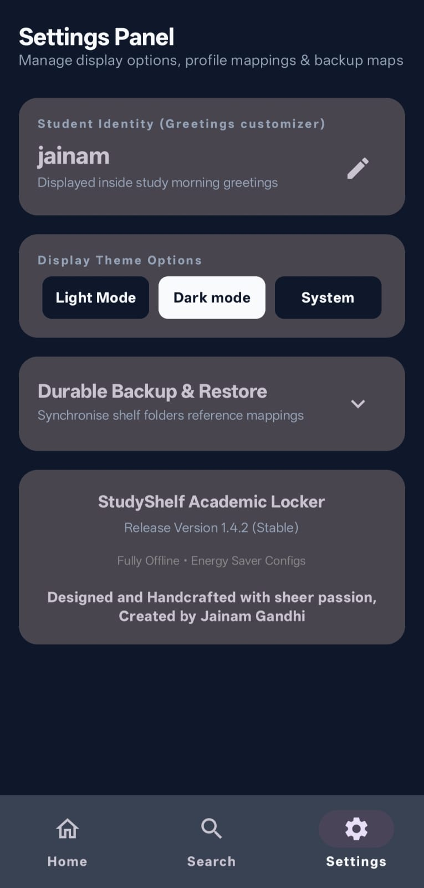
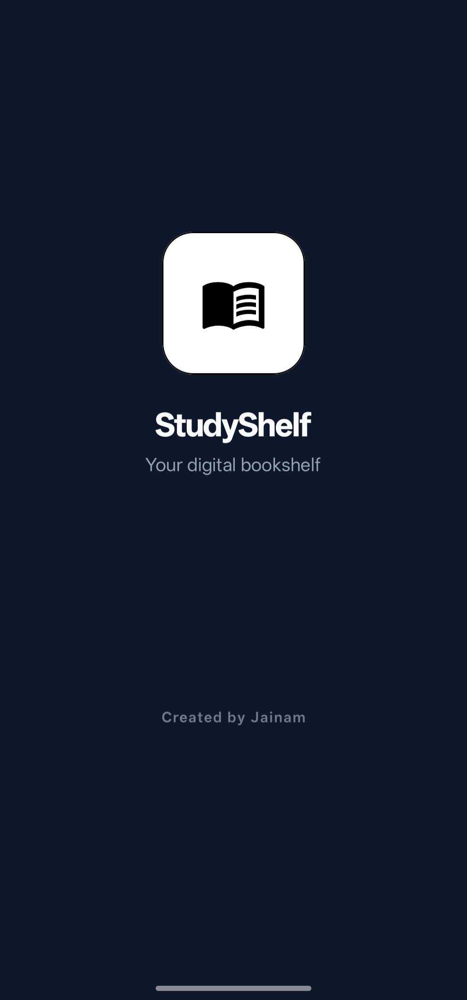
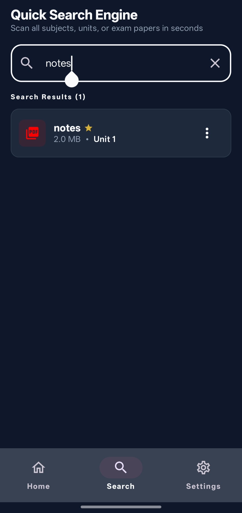
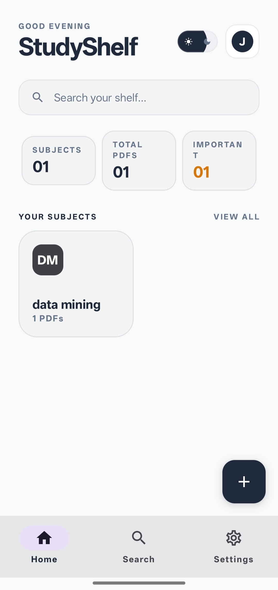
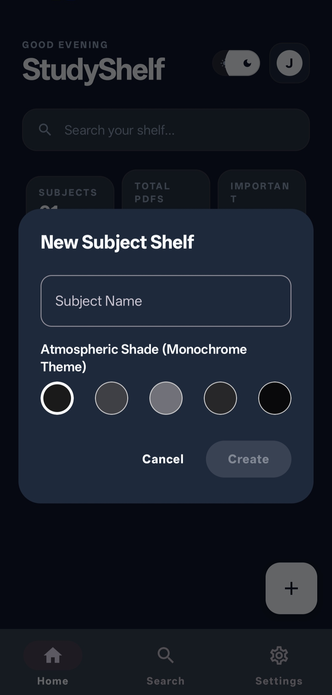
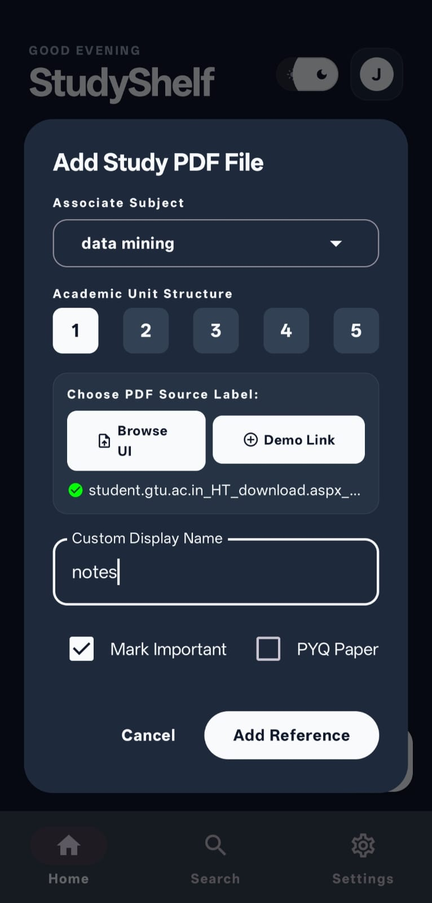
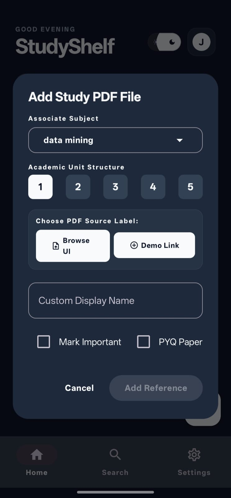
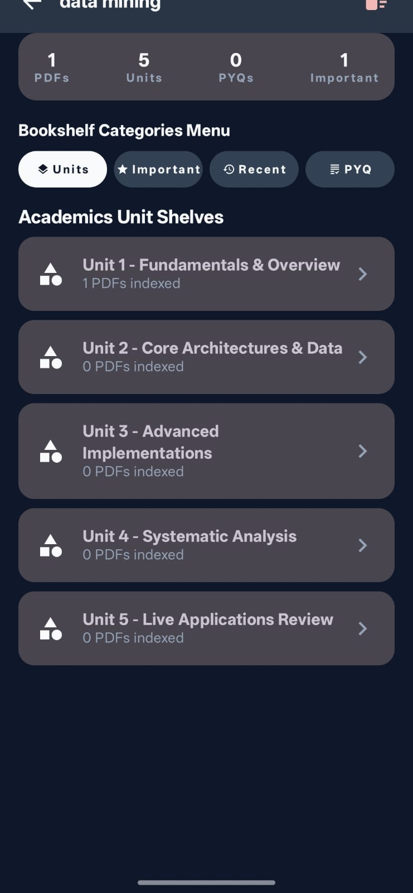

# 📚 StudyShelf

A digital bookshelf for students.

## Problem

Students receive notes, PPTs, assignments, and previous year papers from multiple sources such as WhatsApp, Telegram, Downloads, and college portals.

Over time these files become difficult to locate, especially during exams.

## Solution

StudyShelf organizes existing PDFs into subject-wise collections without moving, renaming, or modifying the original files.

The app creates a study-focused view of your notes so you can find study materials within seconds.

---

## Features

- 📚 Subject-wise organization
- 📄 PDF management
- 🏷 Custom display names
- ⭐ Important notes
- 🔍 Quick search
- 🌙 Light, Dark, and System themes
- 📱 Offline functionality
- 📂 Original files remain untouched

---

## How It Works

1. Create a subject.
2. Select PDFs from your device.
3. Assign custom names if desired.
4. Access all study materials from a clean bookshelf interface.

---

## Screenshots

---

## Built With

- Java
- Android Studio
- Material Design 3
- Android Storage Access Framework

---

## Future Improvements

- Backup & Restore
- Subject Statistics
- Study Progress Tracking
- Export / Import Configuration

---

## Developer

Created by Jainam Gandhi

StudyShelf was developed to solve a real problem faced during exam preparation: finding study materials scattered across multiple folders.